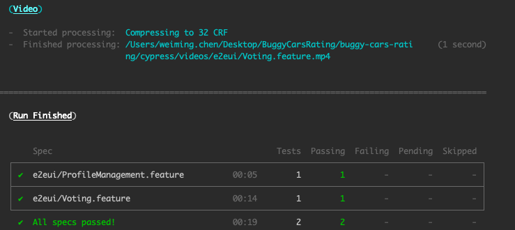
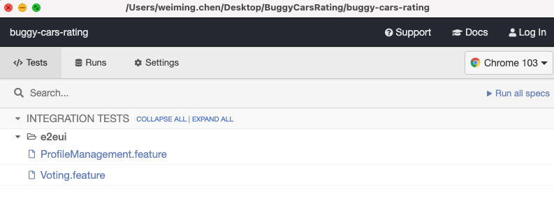
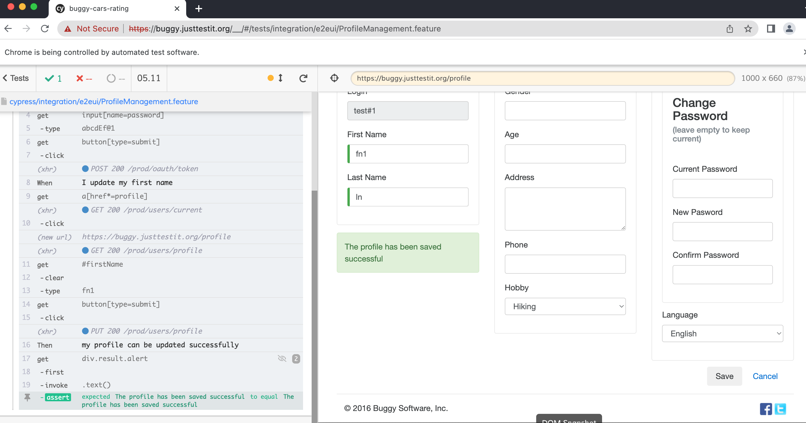

# buggy-cars-rating

Automation tests of using Cypress with Cucumber for Buggy Cars Rating project. Assuming we want to examine the critical functionalities via E2EUI tests. Implemented scenarios are:

- Vote for a popular make car model
- Update profile

Also, I didn't use the latest cypress v10 because the current cypress-cucumber-preprocessor package is not supporing to this version yet.

cypress supports [a number of browsers](https://docs.cypress.io/guides/guides/launching-browsers#Browsers). When running the tests, it will automatically detect what browsers installed on your system. The Electron browser comes by default.

# Prerequisite

Node.js > v10.15 must be installed.

# Installation

```
npm install
```

# Run Tests

The test data is stored in ./cypress/fixtures/data.json. One of the scenarios is to register a new user. Before run the test, the username needs to be updated to a new one which does not exist in the system. The potential improvement is to create a function to create a random username instead of hardcoded. Also, password (especially for production env) need to be stored and retrived from a secure place such as Azure key valut, and AWS KMS.

Run all tests with chrome, execute command below

```
npm run test
```

<p>
    
</p>

Run tests manually by selecting specific feature files, execute command below

```
npm run cypress:open
```

- This would open a cypress run window
- Click on any of the feature file to execute tests
- Identify Object using Cypress native object locator

<p>
    
</p>

<p>
    
</p>

### Screenshots

Cypress automatically takes screenshot on every failure. But this can be turned off using cypress.json configuration (`jsscreenshotOnRunFailure: false`)
Screenshots will be saved automated at cypress/screenshots directory

### Video Recording

Headless execution automatically store the video of execution (`jsvideoUploadOnPasses=false`)
Videos will be saved automated at cypress/videos directory
